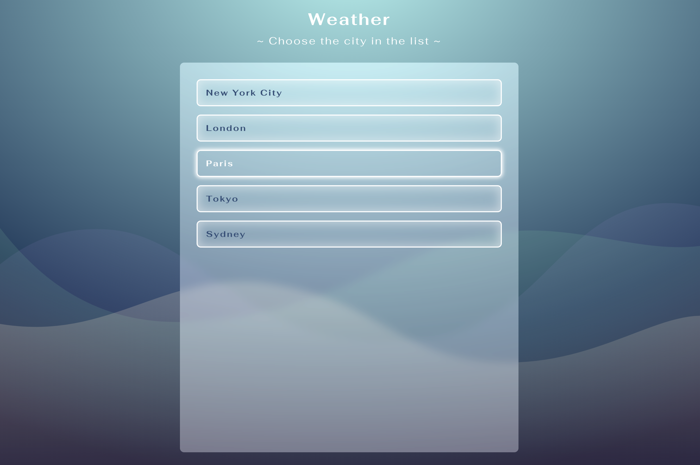
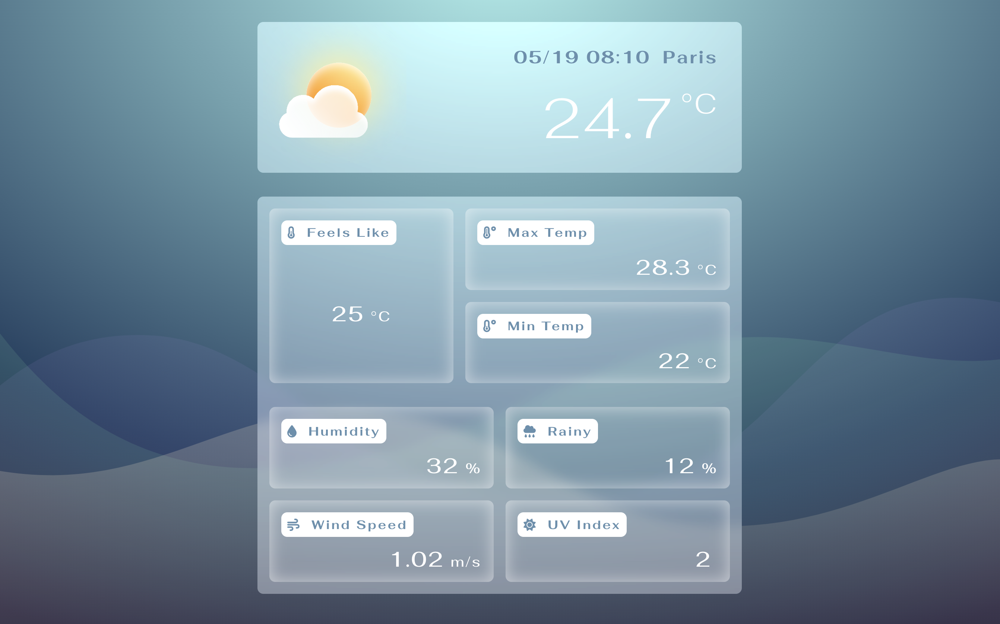

# Weather with React

### This web contains some cities, and you can click the city you want, to know the weather there.

> Website : https://elynnachuang.github.io/weather/





###### ＊The weather icon is design by Faraz Ahmad in Figma https://www.figma.com/community/file/1181824324072862065

---

## 準備 (Prerequisites)

運行此專案前，最好先確定 Node.js 的版本為 18.16.0 或是更新

You're going to need : Node.js v18.16.0 or newer

---

## 啟動專案 (Start Project)

1. 開啟終端機，將此專案複製至本機電腦

   Open your terminal and clone this project to your computer.

   ```
   git clone https://github.com/ElynnaChuang/weather.git
   ```

2. 進入專案資料夾

   Go into weather folder

   ```
   cd weather
   ```

3. 安裝套件

   Install all packages

   ```
    npm install // or run 'npm i'
   ```

4. 啟動程式

   Start this project

   ```
   npm run start
   ```

5. 專案成功在 http://localhost:3000/weather 啟動

   You can now see the web is running at http://localhost:3000/weather

6. 結束程式

   End the web

   ```
   ctrl + c
   ```
